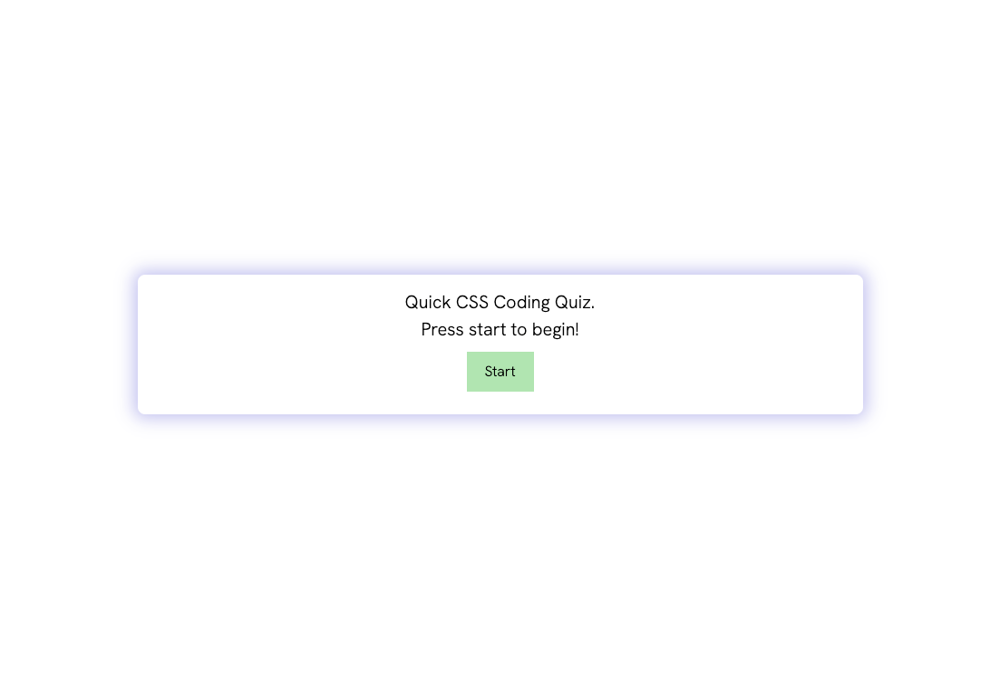

# Quick-Quiz

## Quick Links

[Here](https://rucatues.github.io/Quick-Quiz/) is the link to the coding quiz.

## Description

This quick coding quiz is timed and will stop the quiz at 20 seconds if the user hasn't finished yet. When the timer runs out or the user finished the questions, the Game Over screen shows their score. They can enter their intials which stores their score in local storage and recent scores will be displayed. 

Interval timer inspired by UT Bootcamp "Set Interval" activity. 

## Screenshot

## License 
MIT License
